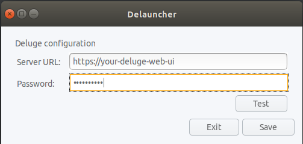

# delauncher
Send magnet links or torrent files from your browser to a deluge server with a single click




# How does it work

Access `delauncher` under Applications > Internet > Delauncher and configure the deluge server URL and the password for the `Web UI`.

After that, clicking a magnet or torrent link on your browser will send it to the deluge server queue.

# How to Install

## Via package

Download latest version from https://github.com/adelolmo/delauncher/releases/latest

```
# dpkg -i delauncher_1.5.0_amd64.deb
```

## Via debian/ubuntu repository

### Setup repository

Follow the instructions [here](https://adelolmo.github.io).

### Install package
```
# apt-get install delauncher
```
